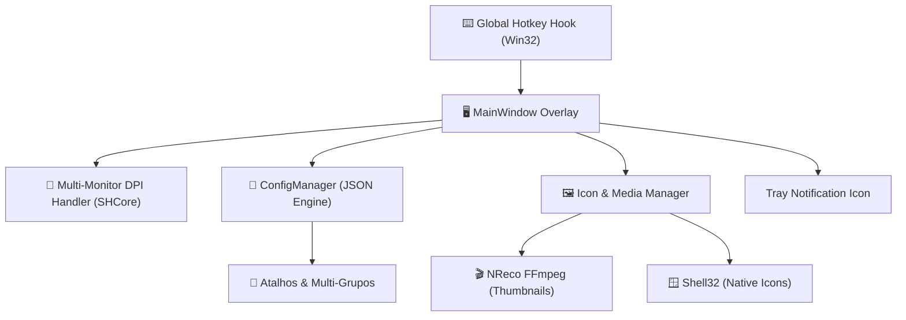

<div align="center">

# 🚀 Oveger

**Launcher & Organizador de Arquivos Moderno de Alta Performance para Windows**

[](https://github.com/ChickChuck2/Oveger/releases/latest)
[](https://github.com/ChickChuck2/Oveger/stargazers)
[](https://github.com/ChickChuck2/Oveger/network/members)
[](https://github.com/ChickChuck2/Oveger/issues)
[](https://github.com/ChickChuck2/Oveger/commits/master)
[](https://github.com/ChickChuck2/Oveger)
[](https://github.com/ChickChuck2/Oveger/blob/master/LICENSE)
[](https://www.microsoft.com/windows)
[](https://dotnet.microsoft.com/)

<br />

<p align="center">
  <b>Oveger</b> é um overlay translúcido ultra-rápido para Windows desenvolvido em <b>C# / WPF</b>, projetado para revolucionar seu fluxo de trabalho, centralizando acesso a executáveis, diretórios, documentos e mídias sem poluir sua área de trabalho.
</p>

<p align="center">
  <a href="#-showcase">Showcase</a> •
  <a href="#-funcionalidades-core">Funcionalidades</a> •
  <a href="#-arquitetura--tech-stack">Arquitetura</a> •
  <a href="#-como-executar">Como Executar</a> •
  <a href="#-tags--tópicos-do-projeto">Tópicos</a> •
  <a href="#-apoie-o-projeto">Apoie</a> •
  <a href="#-documentação--adrs">Documentação</a>
</p>

</div>

---

## 📺 Showcase

https://github.com/ChickChuck2/Oveger/assets/48648882/4140bc81-2b3c-419f-b24d-147118cce3db

---

## ✨ Funcionalidades Core

- ⚡ **Acesso Instantâneo Global**: Invocação imediata por hotkey customizável (Padrão: <kbd>Ctrl</kbd> + <kbd>Alt</kbd> + <kbd>S</kbd>) com prioridade de processo otimizada.
- 🖥️ **Suporte Multi-Monitor & DPI Aware**: Detecção dinâmica do monitor sob o cursor do mouse e renderização com escala Per-Monitor V2 perfeita.
- 📁 **Organização em Múltiplos Grupos**: Itens e atalhos podem ser associados a múltiplos grupos simultaneamente, organizando categorias complexas com facilidade.
- 🎬 **Pré-visualização Inteligente de Mídia**: Extração e geração assíncrona de thumbnails para vídeos (via FFmpeg) e ícones de alta resolução direto do Shell.
- 🛠️ **Gerenciamento Contextual Completo**: Edição de rótulos, caminhos, permissões e propriedades nativas do Windows pelo menu de contexto.
- 🚀 **Integração Profunda com o Shell**: Inicialização silenciosa (`--minimized`), suporte a System Tray com menu dedicado e inicialização com o Windows.
- 🎨 **Design Glassmorphism Fluido**: Interface escura translúcida inspirada no Fluent Design com micro-animações suaves e foco imersivo.

---

## 🏷️ Tags & Tópicos do Projeto

Explore e acompanhe as áreas temáticas do Oveger nos tópicos oficiais do GitHub:

### 💻 Linguagem & Frameworks
[](https://github.com/topics/csharp)
[](https://github.com/topics/dotnet)
[](https://github.com/topics/wpf)
[](https://github.com/topics/win32-api)

### 🎯 Categoria & Produtividade
[](https://github.com/topics/launcher)
[](https://github.com/topics/app-launcher)
[](https://github.com/topics/productivity)
[](https://github.com/topics/file-organizer)
[](https://github.com/topics/desktop-app)

### 🎨 Experiência & Recursos
[](https://github.com/topics/overlay)
[](https://github.com/topics/glassmorphism)
[](https://github.com/topics/fluent-design)
[](https://github.com/topics/hotkey)
[](https://github.com/topics/shortcuts)
[](https://github.com/topics/customizable)

### ⚙️ Plataforma & Licença
[](https://github.com/topics/windows)
[](https://github.com/topics/windows-11)
[](https://github.com/topics/windows-10)
[](https://github.com/topics/open-source)

---

## 🛠️ Arquitetura & Tech Stack

Oveger adota arquitetura desacoplada e modular para garantir estabilidade, segurança e tempo de resposta imediato:



- **Renderização Acelerada**: Desenvolvido sobre **WPF (.NET Framework 4.8.1)** com Direct3D pipeline para animações suaves.
- **Low-Level Interop**: Utiliza **Win32 API (`user32.dll`, `shell32.dll`, `shcore.dll`)** para registro de hotkeys globais, resolução de DPI dinâmica e interação com o Shell do Windows.
- **Processamento de Vídeo**: Processamento assíncrono via **FFmpeg** (`NReco.VideoConverter`) para criação não-bloqueante de miniaturas de mídias.
- **Armazenamento Seguro**: Formato portátil baseado em **JSON** (`Newtonsoft.Json`), com sincronização automática e proteção de integridade.

---

## 🚀 Como Executar

### Pré-requisitos
- **Windows 10** (1809+) ou **Windows 11**
- **.NET Framework 4.8.1 Runtime**

### Instalação Rápida
1. Baixe o pacote mais recente em [Releases](https://github.com/ChickChuck2/Oveger/releases/latest).
2. Extraia o conteúdo e execute `Oveger.exe`.
3. Pressione <kbd>Ctrl</kbd> + <kbd>Alt</kbd> + <kbd>S</kbd> para abrir o overlay.
4. Adicione itens clicando com o botão direito ou via interface de configurações.

### Compilação a partir do Código-Fonte
```powershell
# Clone o repositório
git clone https://github.com/ChickChuck2/Oveger.git
cd Oveger

# Restaure os pacotes NuGet
nuget restore Oveger.sln

# Compile a versão Release com o MSBuild
msbuild Oveger.sln /p:Configuration=Release /p:Platform="Any CPU"
```

---

## 📂 Documentação & ADRs

O projeto mantém documentação arquitetural contínua:

- 📑 **[Visão Geral Arquitetural](docs/architecture/architecture.md)**: Diagramas, camadas e ciclo de vida do overlay.
- 📐 **[ADR 001: Suporte a Múltiplos Grupos](docs/decisions/adr-001-multi-group-support.md)**: Decisão técnica para categorização N:M.
- 📜 **[Histórico de Versões (Changelog)](CHANGELOG.md)**: Detalhamento de todas as alterações semânticas.
- 📋 **[Diretrizes de Contribuição](.github/ISSUE_TEMPLATE/)**: Formulários padronizados para bugs e novas ideias.

---

## ⭐ Apoie o Projeto

Se o **Oveger** ajuda na sua organização diária ou aumentou sua produtividade, considere apoiar o projeto:

<div align="center">

<a href="https://github.com/ChickChuck2/Oveger/stargazers">
  
</a>
&nbsp;
<a href="https://github.com/ChickChuck2/Oveger/network/members">
  
</a>
&nbsp;
<a href="https://github.com/ChickChuck2/Oveger/issues/new/choose">
  
</a>
&nbsp;
<a href="https://twitter.com/intent/tweet?text=Confira%20o%20Oveger%20-%20Um%20launcher%20e%20organizador%20de%20arquivos%20moderno%20para%20Windows!&url=https://github.com/ChickChuck2/Oveger">
  
</a>

<br /><br />

> 💬 Tem uma ideia ou encontrou uma inconsistência? Abra uma [Issue](https://github.com/ChickChuck2/Oveger/issues) ou participe das [Discussões](https://github.com/ChickChuck2/Oveger/discussions)!

</div>

---

<div align="center">

Desenvolvido com carinho por **[Carlos Silva (ChickChuck2)](https://github.com/ChickChuck2)** • Licenciado sob [MIT](LICENSE)

</div>
